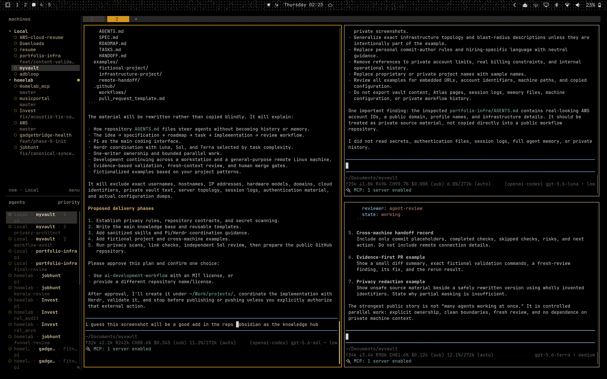

# Agent Workbench

Skills, workflows, knowledge systems, and coordination patterns for agent-assisted development, with requirements, validation, review, merge, and deployment kept under human control.

The core loop is:

**Understand → Decide → Specify → Slice → Implement → Validate → Review → Record**

Chat is temporary. Project contracts and current work live in Git. Durable private knowledge can live in a synchronized Obsidian vault, but it must not be copied into a public repository.

## Start here

1. Read [Getting started](kb/getting-started.md), the [specification](SPEC.md), and the [main flow](kb/main-flow.md).
2. Copy the files in [templates](templates/) into a new repository and replace every placeholder.
3. Choose one reviewable phase. Give each file or worktree one writer.
4. Use an agent such as [Pi](coordination/pi-usage.md) for bounded implementation, or [Herdr](coordination/herdr-coordination.md) when several independent tasks need coordination.
5. Run the repository's real checks. Treat command output, rendered views, and plans as evidence; do not treat an agent report as evidence.
6. Have a human review the complete diff and retain control of merge and deployment.

The fictional [Harbor Lantern example](examples/harbor-lantern/) shows the artifacts together.

## Repository map

| Path | Purpose |
|---|---|
| `AGENTS.md` | Operating rules for agents in this repository |
| `SPEC.md`, `ROADMAP.md`, `TASKS.md` | Product contract, phase order, and current state |
| [`kb/`](kb/) | Explanations and tool notes |
| [`workflows/`](workflows/) | Procedures and evidence gates |
| [`coordination/`](coordination/) | Ownership, routing, and multi-agent guidance |
| [`frontend/`](frontend/) | Visual contracts and rendered validation |
| [`templates/`](templates/) | Portable project and handoff templates |
| [`skills/`](skills/) | Small original agent skills |
| [`examples/`](examples/) | Fictional worked material |
| [`scripts/`](scripts/) | Public-safety and internal-link checks |

## Tool boundaries

- **Obsidian** can be the private knowledge hub for decisions, research, and learning notes. Repository files must stand on their own without that vault.
- **Pi** is a compact terminal coding agent suited to one bounded task with explicit tools and checks.
- **Herdr** coordinates multiple coding-agent sessions. Parallel work is safe only when ownership does not overlap and a coordinator verifies the combined result.
- For interface work, use a written visual contract and rendered evidence. Anthropic's [Claude Code `frontend-design` skill](https://github.com/anthropics/skills/tree/main/skills/frontend-design) is a useful upstream design reference, not material bundled here.

The tools are replaceable. The contract and evidence gates are not.

## Herdr screenshot



The approved screenshot records one real Herdr workspace used while shaping this repository. It illustrates a coordinator assigning bounded tasks to separate agent sessions. It is context, not proof that the resulting work passed review. It is the repository's sole approved exception to the fictional-and-placeholder publication rule; do not infer or reproduce operational details from it.

## Checks

Requires Python 3.11 or later and no third-party packages.

```bash
python scripts/check_public_safety.py
python scripts/check_links.py
```

The first command rejects common credentials, account and network identifiers, machine-specific paths, and unapproved binary files. It is a backstop, not a substitute for reading the full diff. The second checks local Markdown destinations and heading anchors. CI runs both on pushes and pull requests.

## License and influences

Original material in this repository is available under the [MIT License](LICENSE). Third-party projects are linked rather than copied; see [attribution and license notes](ATTRIBUTION.md).
